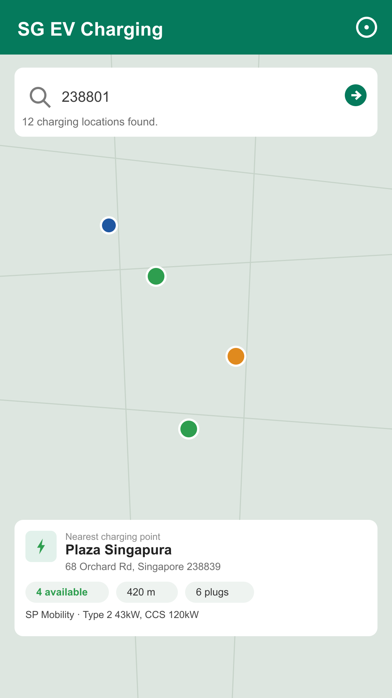
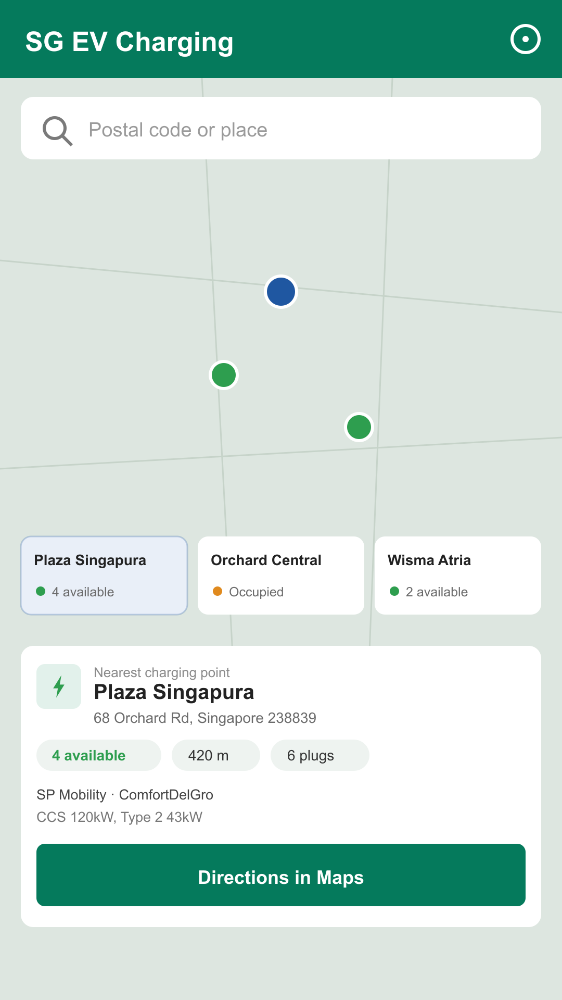

<div align="center">

# SG EV Charging — Android

[](https://kotlinlang.org)
[-3DDC84.svg)](https://developer.android.com)
[](https://developer.android.com/jetpack/compose)
[](https://developers.google.com/maps)
[](#license)

**Find nearby EV charging points in Singapore with live availability from LTA DataMall.**

[Report Bug](https://github.com/alfredang/sgevchargingapp_android/issues) · [Request Feature](https://github.com/alfredang/sgevchargingapp_android/issues)

</div>

## Screenshots

<p align="center">
  
  
</p>

## About

SG EV Charging (Android) is a native Kotlin / Jetpack Compose app for locating electric vehicle
charging points around Singapore. It is a feature parity port of the
[SwiftUI iOS app](https://github.com/alfredang/sgevchargingapp), combining Google Maps location
search, current-location detection, and LTA DataMall EV charging data to show nearby stations,
available plugs, operators, charging speeds, and driving directions in Google Maps.

Key features:

- Search by Singapore postal code or place name.
- Detect the user's current location and rank charging points by distance.
- Display available, occupied, and unavailable connector states.
- Show operator, plug type, power rating, and last-updated metadata.
- Open turn-by-turn directions in Google Maps.
- Map-first interface with nearby charging chips for quick station switching.

## Tech Stack

| Layer | Technology |
| --- | --- |
| App | Kotlin 2.0, Jetpack Compose, Material 3 |
| Maps & Location | Google Maps Compose, Fused Location Provider, platform Geocoder |
| Data | LTA DataMall `EVChargingPoints` and `EVCBatch` APIs (OkHttp + `org.json`) |
| Build | Android Gradle Plugin 8.7, Gradle 8.11, JDK 17 |
| Platform | Android 7.0+ (minSdk 24, target/compileSdk 35), phones |

## Architecture

```text
SG EV Charging (Android)
├── Compose UI
│   ├── SGEVChargingScreen        (map + search + result card + chips)
│   └── ui/theme/Theme.kt
├── State
│   └── ChargingSearchViewModel   (AndroidViewModel)
├── Location
│   ├── UserLocationProvider      (FusedLocationProviderClient)
│   └── LocationSearchService     (Geocoder)
├── Data Access
│   └── LTADataMallClient         (OkHttp)
└── Models
    ├── EVChargingLocation
    ├── ChargingPoint
    ├── PlugType
    └── EVConnector
```

## Project Structure

```text
.
├── app
│   ├── src/main
│   │   ├── java/com/alfredang/sgevcharging
│   │   │   ├── MainActivity.kt
│   │   │   ├── SGEVChargingApp.kt
│   │   │   ├── ChargingSearchViewModel.kt
│   │   │   ├── data/Models.kt
│   │   │   ├── data/LTADataMallClient.kt
│   │   │   ├── location/UserLocationProvider.kt
│   │   │   ├── location/LocationSearchService.kt
│   │   │   └── ui/SGEVChargingScreen.kt
│   │   ├── res
│   │   └── AndroidManifest.xml
│   └── build.gradle.kts
├── gradle/libs.versions.toml
├── settings.gradle.kts
└── README.md
```

## Getting Started

### Prerequisites

- Android Studio Ladybug (or newer) with JDK 17.
- Android SDK Platform 35 and build-tools.
- A **Google Maps Android SDK** API key — <https://console.cloud.google.com/google/maps-apis>.
- An **LTA DataMall** account key — <https://datamall.lta.gov.sg/>.

### Setup

1. Clone the repository:

   ```bash
   git clone https://github.com/alfredang/sgevchargingapp_android.git
   cd sgevchargingapp_android
   ```

2. Add your keys to `local.properties` (this file is git-ignored):

   ```properties
   sdk.dir=/path/to/Android/sdk
   MAPS_API_KEY=your_google_maps_android_key
   LTA_DATAMALL_ACCOUNT_KEY=your_lta_datamall_key
   ```

   `MAPS_API_KEY` is injected into the manifest meta-data; `LTA_DATAMALL_ACCOUNT_KEY`
   is surfaced as `BuildConfig.LTA_DATAMALL_ACCOUNT_KEY`.

3. Build and run:

   ```bash
   ./gradlew :app:assembleDebug      # debug APK
   ./gradlew :app:bundleRelease      # signed release AAB (needs RELEASE_* keys)
   ```

## Data Source

The app uses Singapore Land Transport Authority DataMall APIs:

- `EVChargingPoints` for postal-code scoped charging data.
- `EVCBatch` for island-wide batch data (returns a download link to the full dataset).

API credentials are intentionally excluded from Git. `local.properties` is ignored by `.gitignore`.

## License

No license has been specified yet.

## Developed By

Tertiary Infotech Academy Pte. Ltd.
